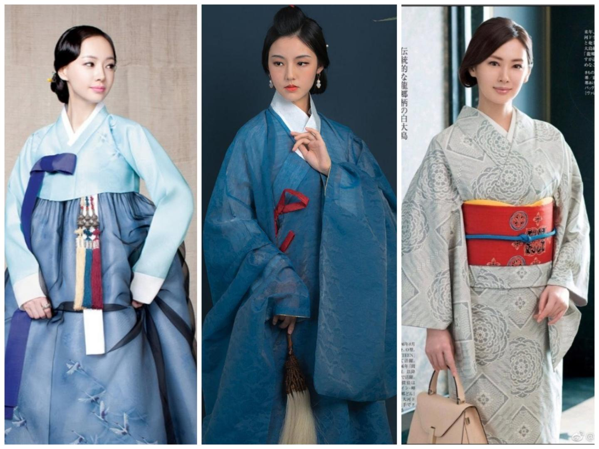

# 告華夏同袍書
某言：「中國有禮儀之大故稱夏，有章服之美謂之華。」華夏四千八百歲，何國而經久如此？吾國正華夏語音以爲國語，正華夏文字以爲國字，何苦而不能正華夏衣冠以爲國服？（按：或謂之漢語、漢字、漢服。漢，朝名也；華夏，國名也。）

上古人民少而禽獸眾，穴居而野處，衣毛、冒皮足以禦寒，漁獵、采果足以充飢。後人民進而禽獸退，漁獵不足養身，遂耕五穀以爲養，樹五果以爲助，植五菜以爲充，長五畜以爲益，氣味合而服之，以補精益氣；是時，民衣麻、葛，黃帝元妃嫘祖見或不足，教民以蠶，繅絲以爲暖。

《易傳》曰：「黃帝、堯、舜垂衣裳而天下治，蓋取諸乾坤。」五帝既歿，夏禹、商湯、周發、秦政，禮義相因，而其色不同，以其五行五德故也。秦政暴民，劉漢弭之，復周禮，聞于二戴，以爲萬世之用可也。

後漢傾頽，人相攻殺，四人已去其三矣；司馬立晉，宗室操戈，五胡見機，割据中原，立國稱帝，夜婬晝烹；漢族蒙難，幾近亡種；冉氏子閔，忍辱負重，屈身胡國，陰令内鬥，是時「趙人斬一胡首送鳳陽門者，文官進位三等，武官悉拜牙門。」胡人見之色變，三載而亡冉魏，而漢人莫能爲所滅也。

自是而二百年，「中國衣冠，自北齊以來，乃全用胡服。窄袖、緋綠短衣、長靿靴、有蹀躞帶，皆胡服也……開元之後，雖仍舊俗，而稍褒博矣。然帶鉤尚穿帶本爲孔，本朝加順折，茂人文也。」趙宋《夢溪筆談》猶此，蒙古質孫服亦見于朱明之朝，華族之服未用廢也。何之故？明太祖令「復衣冠如唐制」，華服爲本，胡服爲末，内外有別也。

明衰，滿洲入主中原，屠戮華夏，剃髮易服。或謂「康乾間滿漢民服皆存」，實畫作也，虛構也，及至嘉慶，所始易服者盡歿，故民未見華服，何以圖之？或謂「十從十不從」，女子亦稍從之，衣襟見化于滿，右不帶乎左；歷二百年，泰西列族爭入中原，然後滿清「師夷長技以制夷」，入洋銃洋炮以戰，洋服隨而入諸夏；光緒甲午，滿清失高麗乎日本，以日本三十倍之土地，五倍之人民，何苦修《馬關條約》，割臺灣、流巨銀，令興工事、瓜分豆剖，而不聼其登陸、南下而久戰？所欲毀約再戰者，皆諸夏人也。韃子治國必不如共和國，結黨必不如共產黨，何爲虛取容納之名，染於人口！子曰：「夷狄之有君，不如諸夏之亡也。」

宣統辛亥，諸夏既逐滿洲，立民國，剪辮放足，男女平權，然後[勝歐西](https://baike.baidu.com/item/第一次世界大戰)，[克日本](https://baike.baidu.com/item/第二次世界大戰)，始中華民族復興之大計。孫中山引洋服而造以中華禮義，袁項城復玄端、深衣，一則曰「驅除韃虜，恢復中華」。未幾袁卒，玄端、深衣之事見棄，以爲專制之存；中山薨而蔣氏剿共，復前清旗袍、馬褂。三十八年，人民共和國立，旗袍馬褂亦以封建主、資本家之故，盡去矣。六十七年，中國改革開放，市場自由，華夏衣冠盡爲洋人所化也。

民國間，康有爲曰：「夫西服未文，然衣制嚴肅，領袖白潔，衣長後衽，乃孔子三統之一。大冠似箕，为漢世士夫之遺，革舄为楚靈王之制，短衣为齊桓之服。」有爲乃前清遺臣，人怨而民攻之。

九十二年，[一人](https://baike.baidu.com/item/王樂天)華服上道，而民知之，然後大國覺醒，華夏衣冠遂得復興矣。華夏衣冠之復興，傳承并重，精神爲上，形制爲次。百年以來，[洋人來華亦喜見華夏衣冠](https://www.163.com/dy/article/FSFD9CLB0538P65G.html)，[徐嬌](https://www.sohu.com/a/735241084_121402623)、[高翔](https://www.thepaper.cn/newsDetail_forward_21224186)上華夏衣冠于國際；華夏衣冠代中山裝、慶齡衫于五十五族之前，不待[革命成功之再辛亥](https://baike.baidu.com/item/2031年)也。

華夏衣冠何所有也？[一曰體服，二曰首服，三曰足服，四曰配飾](https://www.doc88.com/p-57316028484755.html)。其體也完，其系也備，其構、材、紋、著皆久習成俗，其史也五千年，其氣也蓄斂，其質也莊重，其形也十六字，曰「平中交右、寬褖合纓、豐骨冠表、垂提隱正」。
- 平者，平裁對折，不破肩綫，別華夷也。
- 中者，中縫對稱，左右均分，守中正也。
- 交者，規矩方圓，上下交叠，合陰陽也。
- 右者，交領右衽，遮掩尚右，章文明也。
- 寬者，寬袼松擺，縫齊倍要，法自然也。
- 褖者，禮衣必褖，續衽勾邊，明禮義也。
- 合者，腹手合袖，禮服回肘，和合共也。
- 纓者，隱扣繫帶，佩綬結纓，展風貌也。
- 豐者，豐偉上身，儉豐相宜，行正大也。
- 骨者，接縫爲骨，出袼趨收，濟剛柔也。
- 冠者，冠髻寬服，顏展身舒，展大氣也。
- 表者，虛表實裏，衣錦尚絅，惡著文也。
- 垂者，衣褶縱垂，忌交十字，象經緯也。
- 提者，布條圍頸，提衽規襟，勢乾坤也。
- 隱者，襟必齊整，扣必隱順，質無痕也。
- 正者，袷形端正，不偏不褂，端雅正也。

中國（中）、日本（右）、高麗（左）女子，圖源：[知乎](https://zhuanlan.zhihu.com/p/717631734)

收臺灣之後，其年五十以上，習性已久，容不可猝革；五十以下，見在國中之人，若非還原歷史而清裝、旗袍馬褂，與臺獨同命。各宜深戒！或問何故，必謹對曰：「還原歷史必正，而國之形象不可損。」

有《卜算子》爲證：
>漢服代旗袍，彰顯新中國。韃虜驅除還會來，同志知其力。\
>當局所思何？主體堪窮厄？必也人人向大同，舉目青山色。

甲辰年吉月吉日　愛國公民于結合網

附件：
- [華服指南](./華服指南.md)
