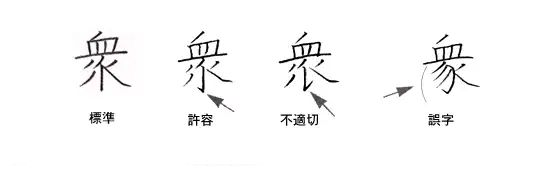

# 文字之法
昔黃帝之别於西羌，史官倉頡見鳥獸蹄迒之跡，知分理之可相别異，故依類象形，故謂之文。未幾，物廣而知進，遂有指事、形聲、會意以達其聲，即謂之字。文者，物象之本也；字者，孳乳而寖多也；著於竹帛謂之書，以迄五帝三王之世，改易殊體，封於泰山者七十有二代，靡有同焉。

《周禮》之六藝者，「一曰五禮，二曰六樂，三曰五射，四曰五馭，五曰六書，六曰九數」六書者，「一曰指事，二曰象形，三曰形聲，四曰會意，五曰轉注，六曰假借。指事者，視而可識，察而見意，「上」「下」是也；象形者，畫成其物，隨體詰詘，「日」「月」是也；形聲者，以事為名，取譬相成，「江」「河」是也；會意者，比類合誼，以見指撝，「武」「信」是也；轉注者，建類一首，同意相受，「考老」是也；假借者，本無其字，依聲託事，「令」「長」是也。」（東漢，許慎《説文解字》序）

及至秦吞二周、滅六國，乃易西周太史籀之大篆以爲小篆。漢隸、章草、魏碑、唐楷，盡顯其美，美美與共。大宋《重修廣韵》、大清《康熙字典》，定字形、音聲，以爲長治久安之道。

滿清敗於洋人，國人以漢字爲不便者多矣，遂欲易之以洋人之拉丁字母，或引俗字之筆簡者以爲正。民國二十四年，蔣中正《第一批簡體字表》，考《錢玄同八法》，收字三百二十四；二十六年，日本侵華，蔣公遷重慶，而漢字簡化之事見棄也。

三十八年，中華人民共和國立，以人民爲己任故，繼民國之遺願，[簡筆化字](../核心簡化字表.md)以易其書。蔣公居臺灣，事事與共和國反，正體字用存。

五十八年，日本入漢字於電腦，兩岸從之，乃知漢字簡化無所用矣。故吾從正體。

## 何簡何不簡
1. 手書簡，電印不簡。
2. 實用簡，文藝不簡。
3. 時務簡，古跡不簡。
4. 分離簡，合并不簡。

## 「通用規範漢字表」所復三十九字
可類推簡化者均得簡化。

- 椏：五椏果，木名。
- 袷：袷袢，胡服名。
- 鑪：化學元素名，序一〇三。
- 釐：可用于姓氏人名，許基切。
- 脩：乾肉也。
- 絜：度大小也，顯結切。
- 扞：「扞格」之「扞」不作「捍」。
- 貲：計量也。
- 蒐：春獵也。
- 椀：橡椀，木名。
- 劄：目劄，疾名。
- 吒：哪吒，神名；然澳門有哪咤廟。

以下「姓氏人名專用」。
- 迺：可用于姓氏人名、地名，餘同「乃」。
- 耑：可用于姓氏人名，都官切。
- 鉅：可用于姓氏人名、地名。
- 昇、陞：可用于姓氏人名、地名，餘同「升」。
- 甯：可用于姓氏人名。
- 颺：可用于姓氏人名。
- 麴：可用于姓氏人名。
- 仝：可用于姓氏人名。
- 甦：可用于姓氏人名。
- 邨：可用于姓氏人名。
- 氾：可用于姓氏人名，符元切。
- 堃：可用于姓氏人名。
- 犇：可用于姓氏人名。
- 龢：可用于姓氏人名。
- 逕：可用于姓氏人名、地名。
- 線：可用于姓氏人名。
- 喆：可用于姓氏人名。
- 祕：可用于姓氏人名。
- 頫：可用于姓氏人名。
- 叚：可用于姓氏人名，音霞。
- 勣：可用于姓氏人名。
- 菉：可用于姓氏人名、地名。
- 淼：可用于姓氏人名、地名。
- 谿：可用于姓氏人名。
- 筦：可用于姓氏人名。
- 澂：可用于姓氏人名。

古籍見上字，所變不過類推簡化，故存之。

## 許容漢字
若「衆」字。標準、許容、不適切、誤字，界限分明。

### 合并漢字分離
考[《核心簡化字表》](../核心簡化字表.md)多正一簡諸字，
- 若簡化入别字，
  - 古本字（回←迴）可用；
  - 重文（众←衆）可用；
  - 太繁（吁←籲）可簡；
  - 構字可解（佣←傭）則可用；
  - 聲旁替換者，入罕用字（构←構）則可用；
  - 否則須分明（后≠後）；
  - 姓氏人名、地名、國號，一律分明，同源分化者（避諱、求生、趨吉等）除外。
- 兩字以上簡化入一字，通用者不分明（團、糰→团）。
- 若簡化入他字類推，可通。
- 若正體字可分析而簡，分而析之（餘→馀、鏇→镟）。

以下諸字互不通用，但「規範漢字」混同。「英文解字」解釋單字，加括號者才是組詞釋義，每個大寫按序對應不同組詞，同一組詞對應多組英文，後續不用大寫起始。
|字形|注音|組詞|英文解字
|-|-|-|-
|卜 蔔|ㄅㄨ˙ ㄅㄜ˙|占卜 蘿蔔|Divination (Radish)
|干 乾 幹|ㄍㄢ ㄍㄢ ㄍㄢˋ|天干地支、干預 乾燥 樹幹|Hevvenly Stem, Intervene Dry Stem
|仆 僕|ㄆㄨ˙ ㄆㄨ˙|前仆後繼 僕人|Fall (to go bravely without fear of dying) Servant
|斗 鬥|ㄉㄡˇ ㄉㄡˋ|北斗、斗酒 鬥爭|Gallon Fight
|丑 醜|ㄔㄡˇ ㄔㄡˇ|子丑寅卯、丑角 醜陋|2nd, Joker Ugly
|扑 撲|ㄆㄨ˙ ㄆㄨ˙|鞭扑 撲滅|Whip Beat
|术 術|ㄓㄨ˙ ㄕㄨ˙|白朮 技術|Herb (_Atractylodes macrocephala_) skill
|叶 葉|ㄒㄧㄝ˙ ㄧㄝ˙|叶韵 根莖葉|To harmonize/accord Leaf
|号 號|ㄏㄠˊ ㄏㄠˋ|哭号 號角、號碼|Yell Horn, Serial number
|只 隻|ㄓˇ ㄓ˙|只有 一隻、隻身|Onely _Classifier for birds_, Single
|朴 樸|ㄆㄛ˙、ㄆㄧㄠ˙ ㄆㄨ˙|朴姓 樸素、質樸|Treebark, Hackberry Simple, plain, sincere
|划 劃→㓰|ㄏㄨㄚˊ ㄏㄨㄚ˙|划船 劃綫、籌劃|To row/paddle To mark off, To plan
|吁 籲→预|ㄒㄩ ㄩˋ|長吁短嘆 呼籲|To sigh To appeal
|吓 嚇|ㄒㄧㄚˋ ㄒㄧㄚˋ，ㄏㄜ˙|虎竹吓 驚嚇、恐嚇|Ville To scare
|曲 麴|ㄑㄩ˙ ㄑㄩ˙|彎曲、曲直、樂曲 酒麴|Bend, Wrong, Tone Yeast for liquor
|后 後|ㄏㄡˋ ㄏㄡˋ|后羿、皇后 後面|Monarch, Consort Back
|冲 衝|ㄔㄨㄥ ㄔㄨㄥ|冲咖啡、冲洗 一飛衝天、衝突、要衝|Pore, Wash Rush, Clash, Thoroughfare
|听 聽|ㄧㄣˇ ㄊㄧㄥ|听听 聽覺|To laff To lissen
|余 餘|ㄩˊ ㄩˊ|余姓 剩餘|I Surplus
|别 彆|ㄅㄧㄝ˙ ㄅㄧㄝ˙|分别、送别、别人、别字 彆扭|Distinguish, Leave, Other, Misspelt Ends of bow, to hold back (Awkward)
|折 摺|ㄓㄝ˙ ㄓㄝ˙|折斷 摺叠|To brake To fold
|沈 瀋|ㄕㄣˇ，ㄔㄣˊ ㄕㄣˇ|沈默 瀋陽|To sink Juice
|谷 穀|ㄍㄨ˙ ㄍㄨ˙|山谷 穀物|Valley Grains
|里 裏|ㄌㄧˇ ㄌㄧˇ|公里 裏面|Mile (Kilometer) Inside
|帘 簾|ㄌㄧㄢˊ ㄌㄧㄢˊ|酒帘 窗簾|Tavern flag Curtain
|征 徵|ㄓㄥ ㄓㄥ|出征 特徵、徵收|Conquer Feature, Collect
|松 鬆|ㄙㄨㄥˊ ㄙㄨㄥ|松樹 鬆緊|Pine Loose
|舍 捨|ㄕㄝˋ ㄕㄝˇ|屋舍 捨棄|House Discard
|表 錶|ㄅㄧㄠˇ ㄅㄧㄠˇ|表面 鐘錶|Outlwk Watch
|姜 薑|ㄐㄧㄤ ㄐㄧㄤ|姜太公 生薑|Jiang_(Surname onely)_ Ginger
|纖→纤 縴→𰬮|ㄙㄧㄢ ㄑㄧㄢˋ|纖維 拉縴|Fine silk (Fiber) Rope
|胜 勝|ㄕㄥ、ㄙㄧㄥ ㄕㄥˋ|胜肽，胜臭 勝利|Peptide, Fishiness Win, overcome
|鐘→钟 鍾→锺|ㄓㄨㄥ ㄓㄨㄥ|鐘錶 鍾愛|Clock Fond
|郁 鬱→蔚|ㄩ˙ ㄩ˙|濃郁 葱鬱|Fragrant Lush

- 帶三點水的「沖」視爲二點水「冲」的舊字形。
- 類推簡化字：劃→㓰、縴→𰬮
- 沈，右不做冗。
- 「纖→纤」使用錯誤的聲旁韵尾（-m→-n），但因爲萬國碼（Unicode）原因暫時適用。
